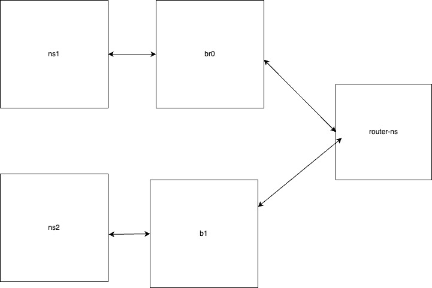
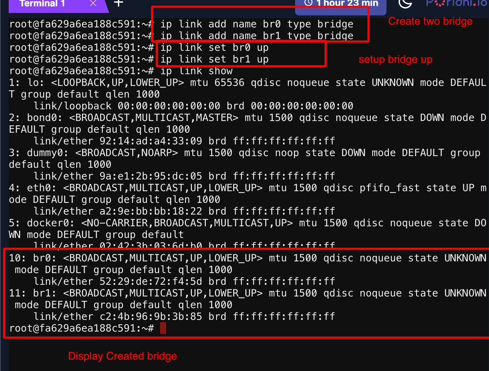
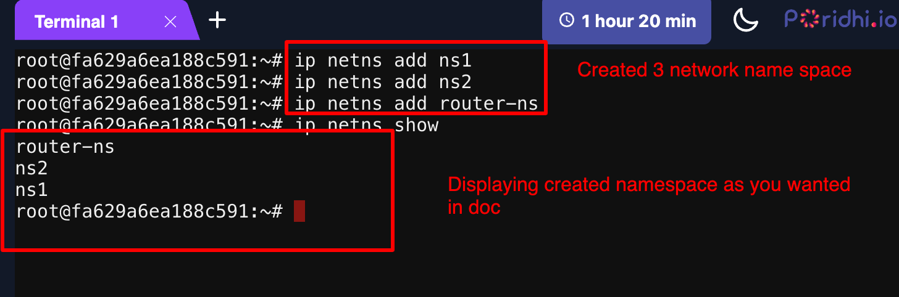
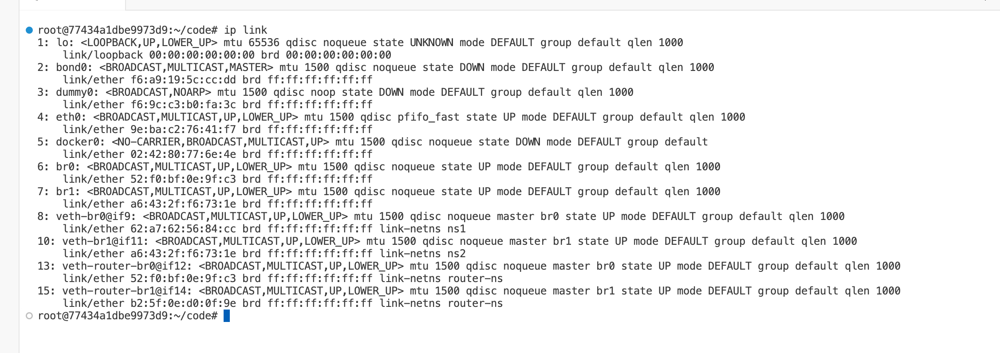
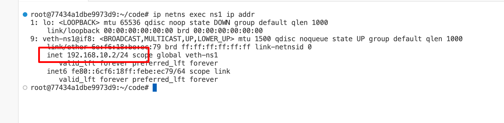
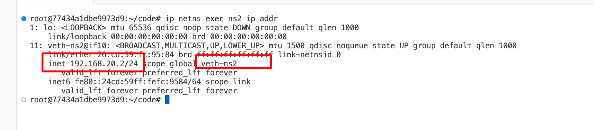
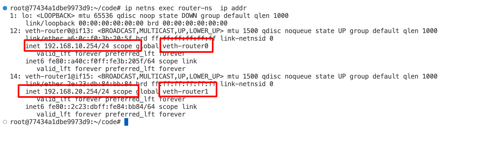
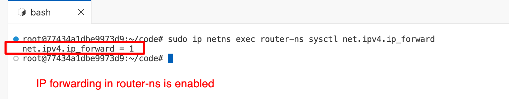
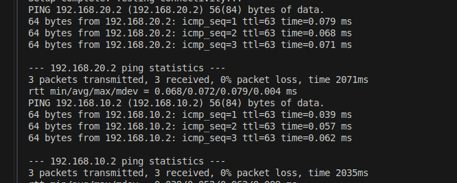

# Linux Network Namespace Simulation

This project demonstrates a Linux network simulation using network namespaces, bridges, and routing. The simulation creates two isolated networks (ns1 and ns2) connected via a dedicated router namespace (router-ns) using two network bridges (br0 and br1).

## Table of Contents

- [Overview](#overview)
- [Network Topology](#network-topology)
- [IP Addressing Scheme](#ip-addressing-scheme)
- [Setup Instructions](#setup-instructions)
- [Visual](#visual)

## Overview

This simulation creates:
- **Two network namespaces (ns1 and ns2)**, each representing a separate network.
- **One router namespace (router-ns)** that connects the two networks.
- **Two bridges (br0 and br1)** to serve as virtual switches connecting the namespaces.

The router namespace forwards traffic between ns1 and ns2, ensuring connectivity between the isolated networks.

## Network Topology
The topology for the simulation is as follows:



## IP Addressing Scheme
- **Network A (br0):**
  - **ns1:** `192.168.10.10/24`
  - **router-ns (r-ns0):** `192.168.10.1/24`

- **Network B (br1):**
  - **ns2:** `192.168.20.10/24`
  - **router-ns (r-ns1):** `192.168.20.1/24`

## Setup Instructions

1. **Clone the Repository:**

```bash
git clone git@github.com:imonhossain/networking-exam-1.git
cd networking-exam-1
sudo bash exam.sh
```

## Visual
 - 1. Creating bridges and up
```bash
sudo ip link add name br0 type bridge
sudo ip link add name br1 type bridge
sudo ip link set br0 up
sudo ip link set br1 up
sudo ip link show
```



 - 2. Creating namespaces
```bash
sudo ip netns add ns1
sudo ip netns add ns2
sudo ip netns add router-ns
sudo ip netns show
```



 - 3. ⁠Create Virtual Interfaces and Connections
```bash
sudo ip link add veth-ns1 type veth peer name veth-br0
sudo ip link set veth-ns1 netns ns1
sudo ip link set veth-br0 master br0
sudo ip link set veth-br0 up
sudo ip netns exec ns1 ip link set veth-ns1 up


sudo ip link add veth-ns2 type veth peer name veth-br1
sudo ip link set veth-ns2 netns ns2
sudo ip link set veth-br1 master br1
sudo ip link set veth-br1 up
sudo ip netns exec ns2 ip link set veth-ns2 up


sudo ip link add veth-router-br0 type veth peer name veth-router0
sudo ip link set veth-router0 netns router-ns
sudo ip link set veth-router-br0 master br0
sudo ip link set veth-router-br0 up
sudo ip netns exec router-ns ip link set veth-router0 up


sudo ip link add veth-router-br1 type veth peer name veth-router1
sudo ip link set veth-router1 netns router-ns
sudo ip link set veth-router-br1 master br1
sudo ip link set veth-router-br1 up
sudo ip netns exec router-ns ip link set veth-router1 up
sudo ip link show
```



 - 4. ⁠Configure IP Addresses
```bash
sudo ip netns exec ns1 ip addr add 192.168.10.2/24 dev veth-ns1
sudo ip netns exec ns1 ip route add default via 192.168.10.254

sudo ip netns exec ns2 ip addr add 192.168.20.2/24 dev veth-ns2
sudo ip netns exec ns2 ip route add default via 192.168.20.254

sudo ip netns exec router-ns ip addr add 192.168.10.254/24 dev veth-router0
sudo ip netns exec router-ns ip addr add 192.168.20.254/24 dev veth-router1
```





 - 5. Enable IP forwarding in router-ns
```bash
sudo ip netns exec router-ns sysctl -w net.ipv4.ip_forward=1
```


 - 6. Test connectivity
```bash
sudo ip netns exec ns1 ping -c 3 192.168.20.2
sudo ip netns exec ns2 ping -c 3 192.168.10.2
```

